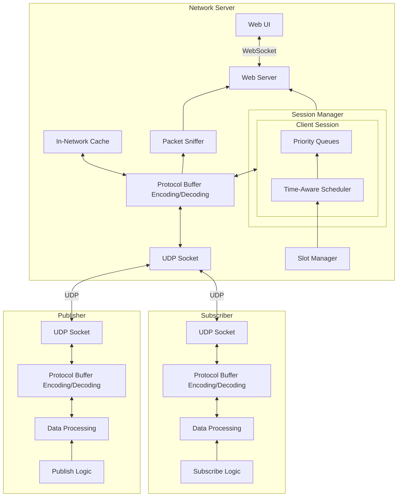
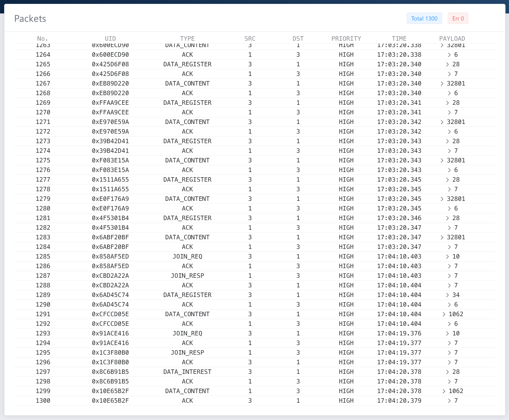
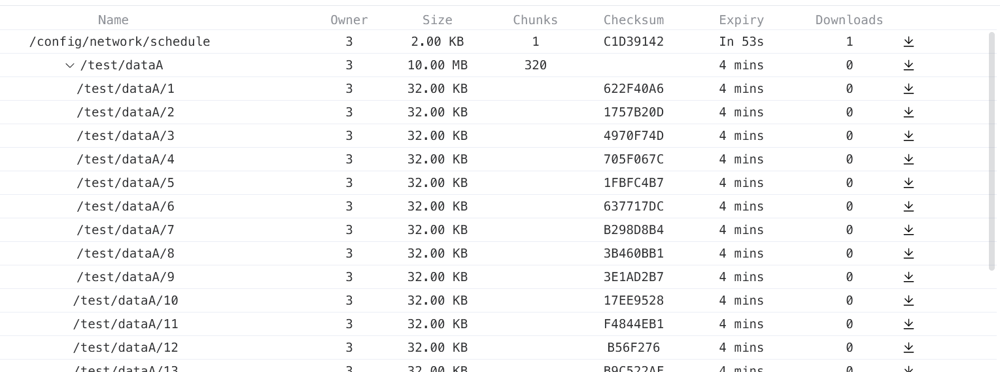

# Real-Time Data Exchange (RTDEX)

A real-time data exchange protocol and library inspired by Named-Data Networking (NDN) and IEEE 802.1Qbv Time-aware Shaper (TAS).

## Features

- Hierarchical name-based data access
- In-network data caching and async data transfer
- Time-aware priority queues for bounded latency
- Protocol Buffer integration
- Flexible session management and housekeeping
- Data chunking and checksum
- WebSocket support for monitoring

## Architecture



## Usage

Publish data:

```python
client.put('/sensors/outdoor/temperature', b'22.5', freshness=300)
client.put('/config/system/network', json.dumps({'mode': 'active', 'interval': 5}).encode(), freshness=3600)
client.put('/data/images/2023/06/01/sunset.jpg', open('sunset.jpg', 'rb').read(), freshness=86400)
```

Retrieve data:

```python
data = client.get('/sensors/outdoor/temperature')
data = client.get('/config/system/network')
data = client.get('/data/images/2023/06/01/sunset.jpg')
```




## Note

Use `pip install protobuf==3.20.*`
