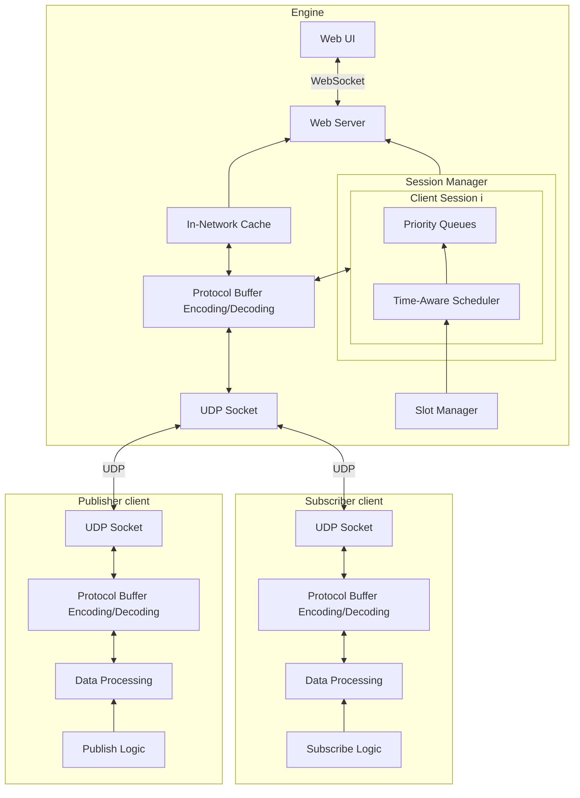

# Real-Time Data Exchange (RTDEX)

A real-time data exchange protocol and library inspired by Named-Data Networking (NDN) and IEEE 802.1Qbv Time-aware Shaper (TAS).

## Features

- Hierarchical name-based data access
- In-network data caching and async data transfer
- Time-aware priority queues for bounded latency
- Protocol Buffer integration
- Flexible session management and housekeeping
- Data chunking and checksum

## Architecture



## Usage

```go
package main

import (
	"fmt"

	"github.com/AmyangXYZ/rtdex"
)

func main() {
	engine := rtdex.NewEngine(rtdex.DefaultConfig)
	go engine.Start()

	client := rtdex.NewClient(3, "t", rtdex.DefaultConfig)
	client.Connect()
	client.Put("/data/test", []byte("test"), 10)

	if data, err := client.Get("/data/test"); err != nil {
		fmt.Println(err)
	} else {
		fmt.Println("data:", string(data))
	}

	client.Disconnect()
	go engine.Stop()
	select {}
}
```


